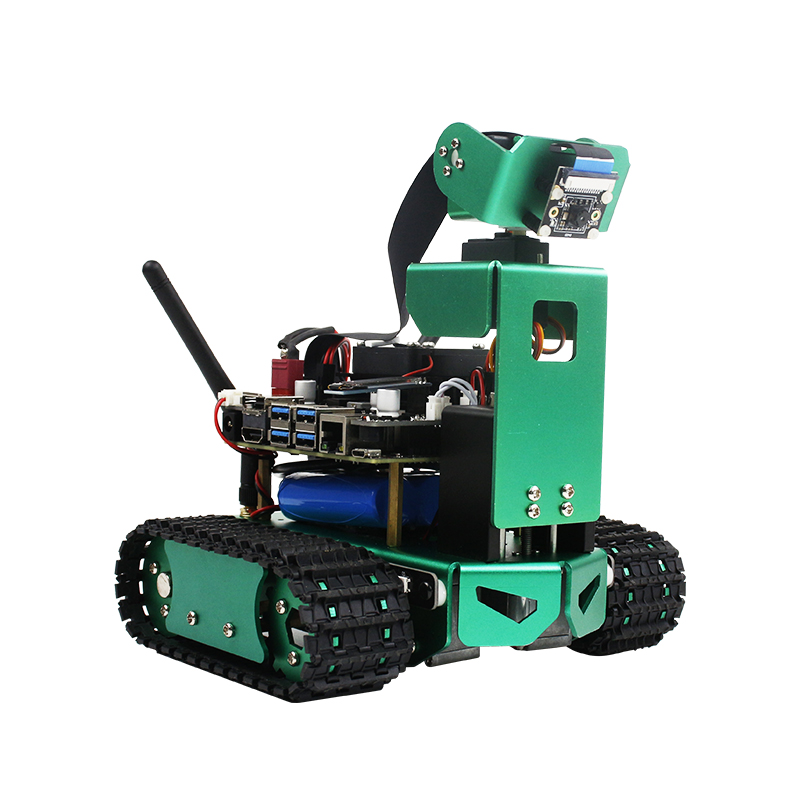
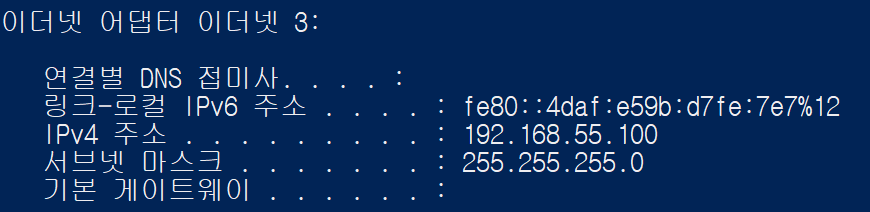

# Jetbot_controller+Face_tracker

---

<div align="center">
  
</div>

### This project is consisted of two small projects

### 1. moving control(body + head) using usb joystick

### 2. Face tracker(Automatic head control) with Object detection model

---

# Environment & Installation

I have tested on Ubuntu 18.04, Jetson-nano, python 3.6.

You can setup environment and install python packages through the page below.

[Yahboom](http://www.yahboom.net/study/JETBOT)

```
opencv-python == 4.5.3
jupyter == 
```

```
Adafruit-GPIO == 1.0.4
Adafruit-MotorHAT == 1.4.0
Adafruit-PureIO == 1.1.9
Adafruit-SSD1306 == 1.6.2
jetbot == 0.3.0
Jetson.GPIO == 1.0.0
```

you can install these packages using links above

```
tensorflow-gpu == 1.13.1+nv19.3
mtcnn == 0.0.9
```

Installing tensorflow-gpu in jetson nano can be done in this [[link](https://docs.nvidia.com/deeplearning/frameworks/install-tf-jetson-platform/index.html)]

# Jetson nano usb Headless mode

Headless mode means windowless, that is, a mode that allows the Jetson nano to be remotely accessed and used as a server without being connected to the monitor

You can access it using a remote access protocol such as ssh (secure shell protocol). If you are connected to the same network and know the internal IP address, you can connect, but you can also connect locally using a USB cable.

If you connect USB cable to the host pc(in this case, tested on Windows10), it automatically connects to local network environment with address like `192.168.55.100` 

<div align="center">
  
</div>

The picture above is host pc's IP address of the network which is established with USB cable. Ip address of Jetson Nano is set to `192.168.55.1` . Therefore, you can remotely connect to Jetson Nano.

```
ssh <username>@192.168.55.1
```

If you successfully connected to Jetbot, run the code below to run ipython code

```
jupyter notebook
```
<br>
There is three files in this project
* `Face_Tracker_Handle.ipynb` - Main implementation file, There are some instructions in this ipython file.
* `PID.py` - I use PID(Proportional Intergral Differential) algorithm to control servo motor which corresponds to head of Jetbot
* `servoserial.py` - python file for connect to servo serial motor